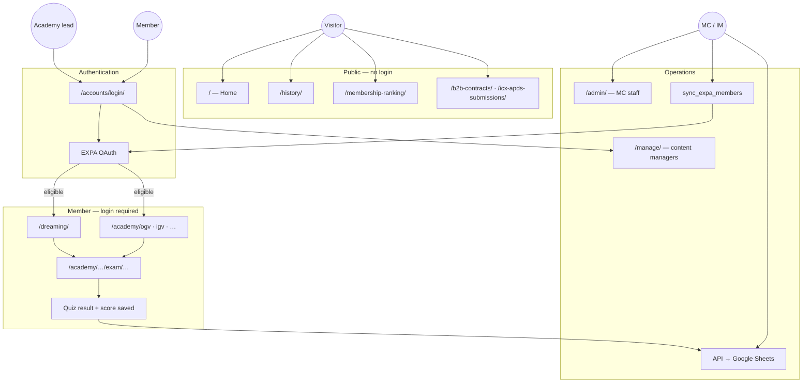
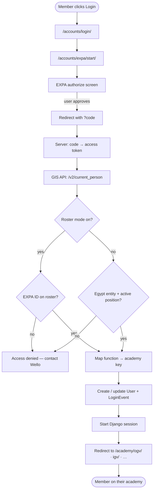
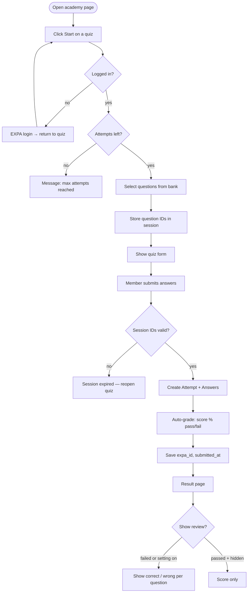
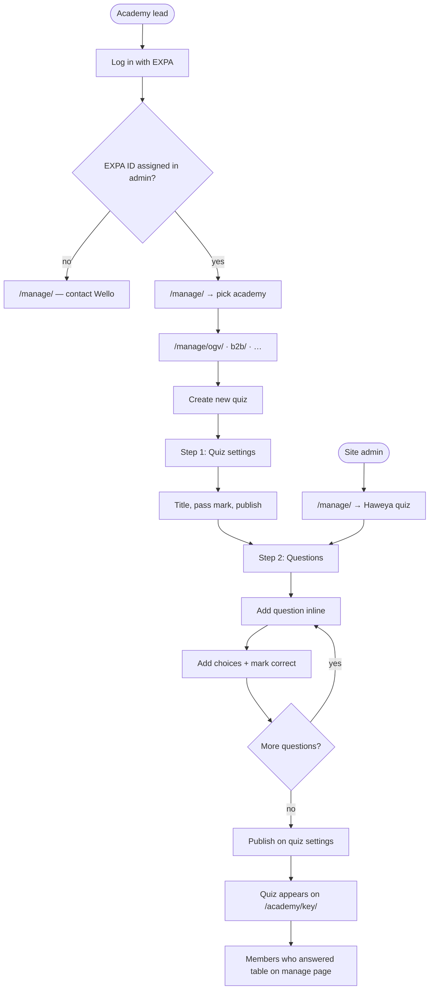
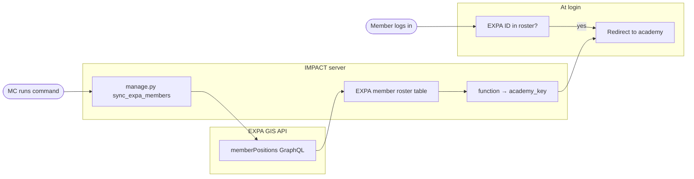
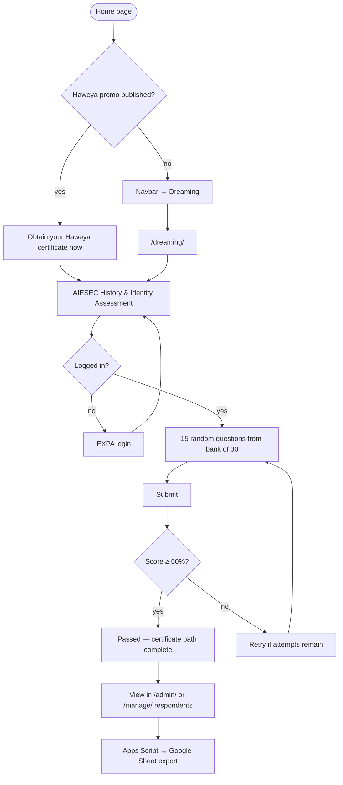
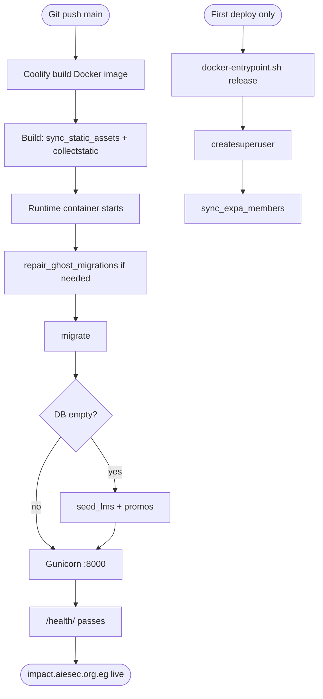
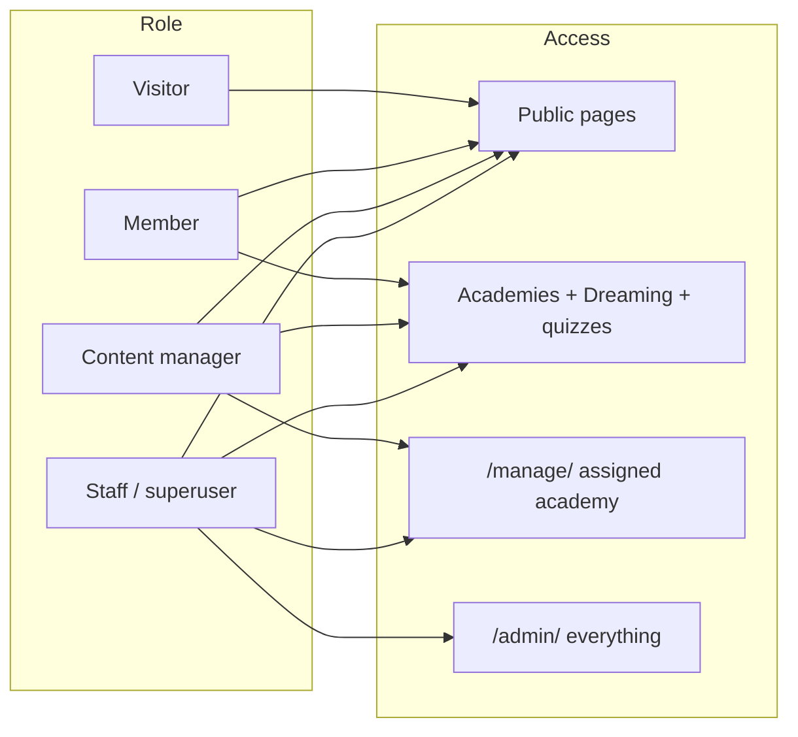

# IMPACT — Flowcharts

Visual maps of how members, managers, and the platform interact. Render these in GitHub, VS Code (Mermaid preview), or [mermaid.live](https://mermaid.live).

---

## 1. Platform overview

---

## 2. EXPA login flow

---

## 3. Member takes a quiz

---

## 4. Content manager — add a quiz

---

## 5. Member roster sync

---

## 6. Haweya certificate path

---

## 7. Deploy and startup (production)

---

## 8. Who sees what

---

*See [IMPACT.md](IMPACT.md) for full written documentation.*
